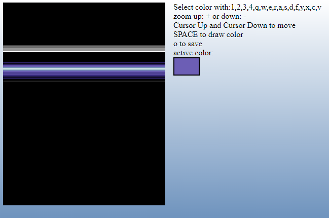

# rastereditor

## Screenshot

## description 
A very simple raster bar editor for commodore 64 ( c64 ) raster bars. Exports to a .txt file with dc.b values of the colors. 
This is an very old try - so don´t expect to much of it ;) But if you need some values, it works fine. 
No funky menu - just key usage. 

## usage
the usage is all by keys:

| Key        |                      Function                       | 
|:-----------|:---------------------------------------------------:| 
| +          |                 Zoom UP the canvas                  | 
| -          |                Zoom DOWN the canvas                 | 
| Arrow up   |             moves the Raster Cursor UP              | 
| Arrow down |            moves the Raster Cursor Down             |
| SPACE      |      draws the current Raster Color to canvas       |
| o          | saves the whole canvas as dc.b Data into a txt file |

The colors are selected with just 4 keys in 1 row on the keys:

* 1 2 3 4
* q w e r
* a s d f
* y x c v

So you could select a color or set it with space with the left hand and jump up and down with the arrow keys with the right hand.

| Key | color       | 
|:----|:------------|
| 1   | black       |
| 2   | white       |
| 3   | red         |
| 4   | cyan        |
|     |             |
| q   | purple      |
| w   | green       |
| e   | blue        |
| r   | yellow      |
|     |             |
| a   | orange      |
| s   | brown       |
| d   | pink        |
| f   | dark grey   |
|     |             |
| y   | grey        |
| x   | light green |
| c   | light blue  |
| v   | light grey  |

Like I wrote: an old and simple design, but it does the job if you are not in need of animation;)

